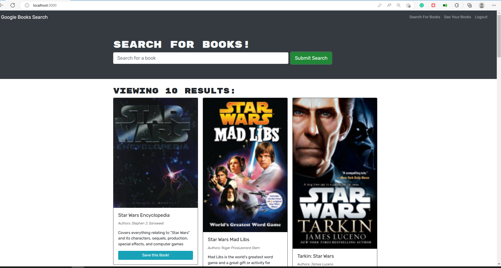

# Book-Search-Engine

The project involved a starter code with a fully functioning Google Books API search engine built with a RESTful API. It was required to change it to be a GraphQL API built with Apollo Server. The app was built using the MERN stack with a React front end, MongoDB database, and Node.js/Express.js server and API. It's already set up to allow users to save book searches to the back end.

# Features for the App 
-----------------------------------------------------------------------   
- A book search engine app with a home page with the options Search for Books and Login/Signup and an input field to search for books and a submit button
- When user click on the Search for Books menu option and user is presented with an input field to search for books and a submit button
- When a user is not logged in and enter a search term in the input field and click the submit button and presented with several search results, each featuring a book’s title, author, description, image, and a link to that book on the Google Books site.
- When user click on the Login/Signup menu option a modal appears on the screen with a toggle between the option to log in or sign up
- When the toggle is set to Signup; user is presented with three inputs for a username, an email address, and a password, and a signup button
- When the toggle is set to Login, user is presented with two inputs for an email address and a password, and a login button.
- When user enters a valid email address and creates a password and click on the signup button a user account is created and user can log in to the site
- When a user is logged in to the site the menu options change to Search for Books, an option to see saved books, and Logout
- When a user is logged in a button to save a book to their account will be presented at the button of each book’s panel. And when the user clicks on save that book’s information is saved to their account. 
- User can check their list of saved books with an option to remove books from their list.
- When a user is logged out of the site and presented with a menu with the options Search for Books and Login/Signup and an input field to search for books and a submit button  

# Built with
-----------------------------------------------------------------------
-	ReactJS 
- 	GraphQL
-	MongoDB
- 	Node.js/Express.js server
-	apollo-server-express

## Installation
-----------------------------------------------------------------------
The following npm installs are recommended: 

-	graphql
-	react
- react-bootstrap
- react-dom
- react-router-dom
- react-scripts
- concurrently

# Links
-----------------------------------------------------------------------
### [Demo Video](https://youtu.be/axYLkXPBwqs)
### [Repository](https://github.com/Micky-Ad/Book-Search-Engine)

# Screenshot:
----------------------------------------------------------------------
 

# Usage:
----------------------------------------------------------------------
-	A book search engine site that utilizes Google Books API and GraphQL API.

# License:
-----------------------------------------------------------------------
[MIT](https://choosealicense.com/licenses/mit/)
